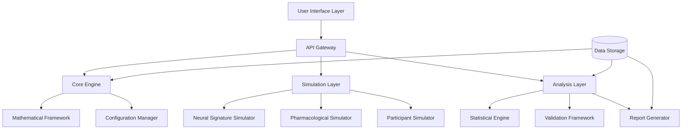

# Design Document

## Overview

The APGI Framework Falsification Testing System is designed as a modular, extensible platform for implementing and validating the Interoceptive Predictive Integration (APGI) Framework through comprehensive falsification testing. The system combines mathematical modeling, neural signature simulation, statistical analysis, and experimental control mechanisms to test the four primary falsification criteria outlined in the APGI Framework.

The architecture follows a layered approach with clear separation between the core mathematical engine, simulation modules, analysis components, and user interfaces. This design enables researchers to systematically test whether the APGI Framework can be falsified under controlled experimental conditions while maintaining scientific rigor and reproducibility.

## Architecture

### System Architecture Overview



### Core Components

1. **Mathematical Framework Engine**: Implements the APGI ignition threshold equation and related calculations
2. **Neural Signature Simulator**: Generates realistic neural signatures (P3b, gamma, BOLD, PCI)
3. **Falsification Test Controller**: Orchestrates the four primary falsification test scenarios
4. **Statistical Analysis Engine**: Performs comprehensive statistical validation and significance testing
5. **Experimental Control Manager**: Ensures proper experimental conditions and controls
6. **Data Management System**: Handles storage, versioning, and export of experimental data

## Components and Interfaces

### Mathematical Framework Component

**Purpose**: Implements the core APGI ignition threshold equation and related mathematical operations.

**Key Classes**:
- `IPIEquation`: Main equation implementation
- `PrecisionCalculator`: Handles Πₑ and Πᵢ calculations
- `PredictionErrorProcessor`: Manages εₑ and εᵢ standardization
- `SomaticMarkerEngine`: Implements M_{c,a} gain calculations
- `ThresholdManager`: Handles dynamic θₜ adjustments

**Interface**:
```python
class IPIEquation:
    def calculate_surprise(self, extero_error: float, intero_error: float, 
                          extero_precision: float, intero_precision: float,
                          somatic_gain: float) -> float
    
    def calculate_ignition_probability(self, surprise: float, threshold: float, 
                                     steepness: float) -> float
    
    def is_ignition_triggered(self, surprise: float, threshold: float) -> bool
```

### Neural Signature Simulator

**Purpose**: Generates realistic neural signatures for testing falsification scenarios.

**Key Classes**:
- `P3bSimulator`: Generates P3b ERP signatures with configurable amplitude/latency
- `GammaSimulator`: Simulates gamma-band synchrony and phase-locking values
- `BOLDSimulator`: Creates BOLD activation patterns for specified brain regions
- `PCICalculator`: Computes Perturbational Complexity Index values
- `SignatureValidator`: Validates signatures against threshold criteria

**Interface**:
```python
class NeuralSignatureSimulator:
    def generate_p3b(self, amplitude_range: tuple, latency_range: tuple) -> P3bSignature
    def generate_gamma_synchrony(self, plv_threshold: float, duration: int) -> GammaSignature
    def generate_bold_activation(self, regions: List[str], z_threshold: float) -> BOLDSignature
    def calculate_pci(self, connectivity_matrix: np.ndarray) -> float
```

### Falsification Test Controller

**Purpose**: Orchestrates the four primary falsification test scenarios with proper experimental controls.

**Key Classes**:
- `PrimaryFalsificationTest`: Tests full ignition signatures without consciousness
- `ConsciousnessWithoutIgnitionTest`: Tests consciousness without ignition signatures
- `ThresholdInsensitivityTest`: Tests neuromodulatory threshold dynamics
- `SomaBiasTest`: Tests interoceptive vs exteroceptive bias
- `ExperimentalController`: Manages test execution and validation

**Interface**:
```python
class FalsificationTestController:
    def run_primary_falsification_test(self, n_trials: int) -> FalsificationResult
    def run_consciousness_without_ignition_test(self, n_trials: int) -> FalsificationResult
    def run_threshold_insensitivity_test(self, drug_conditions: List[str]) -> FalsificationResult
    def run_soma_bias_test(self, n_participants: int) -> FalsificationResult
```

### Statistical Analysis Engine

**Purpose**: Provides comprehensive statistical analysis and validation capabilities.

**Key Classes**:
- `StatisticalTester`: Performs hypothesis testing and significance calculations
- `EffectSizeCalculator`: Computes Cohen's d and confidence intervals
- `PowerAnalyzer`: Handles sample size and power calculations
- `MultipleComparisonsCorrector`: Applies cluster correction and FDR control
- `ReplicationTracker`: Tracks results across multiple simulated labs

**Interface**:
```python
class StatisticalAnalysisEngine:
    def perform_t_test(self, group1: np.ndarray, group2: np.ndarray) -> StatResult
    def calculate_effect_size(self, group1: np.ndarray, group2: np.ndarray) -> EffectSize
    def cluster_correction(self, p_values: np.ndarray, alpha: float) -> np.ndarray
    def assess_replication(self, results: List[ExperimentResult]) -> ReplicationAssessment
```

## Data Models

### Core Data Structures

```python
@dataclass
class IPIParameters:
    extero_precision: float
    intero_precision: float
    extero_error: float
    intero_error: float
    somatic_gain: float
    threshold: float
    steepness: float

@dataclass
class NeuralSignatures:
    p3b_amplitude: float
    p3b_latency: float
    gamma_plv: float
    gamma_duration: float
    bold_activations: Dict[str, float]  # region -> z-score
    pci_value: float

@dataclass
class ConsciousnessAssessment:
    subjective_report: bool
    forced_choice_accuracy: float
    confidence_rating: float
    wagering_behavior: float
    metacognitive_sensitivity: float

@dataclass
class FalsificationResult:
    test_type: str
    is_falsified: bool
    confidence_level: float
    effect_size: float
    p_value: float
    statistical_power: float
    replication_count: int
    detailed_results: Dict[str, Any]
```

### Experimental Data Models

```python
@dataclass
class ExperimentalTrial:
    trial_id: str
    participant_id: str
    condition: str
    ipi_parameters: IPIParameters
    neural_signatures: NeuralSignatures
    consciousness_assessment: ConsciousnessAssessment
    timestamp: datetime
    metadata: Dict[str, Any]

@dataclass
class PharmacologicalCondition:
    drug_name: str
    dosage: float
    administration_time: datetime
    expected_effect: str
    measured_threshold_change: float
    control_measures: Dict[str, float]  # pupil, physiology, etc.
```

## Error Handling

### Error Categories and Handling Strategies

1. **Mathematical Computation Errors**
   - Division by zero in precision calculations
   - Invalid parameter ranges (negative precisions, etc.)
   - Numerical instability in sigmoid calculations
   - **Strategy**: Input validation, graceful degradation, logging

2. **Simulation Errors**
   - Failed neural signature generation
   - Invalid experimental conditions
   - Insufficient statistical power
   - **Strategy**: Retry mechanisms, fallback parameters, user notification

3. **Statistical Analysis Errors**
   - Insufficient sample sizes
   - Violated statistical assumptions
   - Multiple comparisons issues
   - **Strategy**: Automatic corrections, warnings, alternative tests

4. **Data Integrity Errors**
   - Corrupted experimental data
   - Missing required measurements
   - Inconsistent timestamps
   - **Strategy**: Data validation, backup systems, recovery procedures

### Error Handling Implementation

```python
class IPIFrameworkError(Exception):
    """Base exception for APGI Framework errors"""
    pass

class MathematicalError(IPIFrameworkError):
    """Errors in mathematical calculations"""
    pass

class SimulationError(IPIFrameworkError):
    """Errors in neural signature simulation"""
    pass

class StatisticalError(IPIFrameworkError):
    """Errors in statistical analysis"""
    pass

class ValidationError(IPIFrameworkError):
    """Errors in experimental validation"""
    pass
```

## Testing Strategy

### Unit Testing

**Mathematical Framework Tests**:
- Test equation implementations against known values
- Validate parameter ranges and edge cases
- Test numerical stability and precision
- Verify sigmoid function behavior

**Neural Signature Tests**:
- Test signature generation within specified ranges
- Validate threshold detection accuracy
- Test signature combination scenarios
- Verify temporal dynamics

**Statistical Analysis Tests**:
- Test statistical functions against R/MATLAB implementations
- Validate multiple comparisons corrections
- Test power analysis calculations
- Verify effect size computations

### Integration Testing

**Falsification Test Integration**:
- Test complete falsification scenarios end-to-end
- Validate data flow between components
- Test experimental control mechanisms
- Verify result aggregation and reporting

**Cross-Component Testing**:
- Test mathematical engine with simulation components
- Validate statistical analysis with generated data
- Test data persistence and retrieval
- Verify error propagation and handling

### Validation Testing

**Scientific Validation**:
- Compare results with published neuroscience literature
- Validate against known consciousness research findings
- Test edge cases from clinical populations
- Verify statistical methodology compliance

**Performance Testing**:
- Test large-scale simulation performance
- Validate memory usage with extensive datasets
- Test concurrent experiment execution
- Verify scalability with multiple participants

### Test Data and Fixtures

```python
# Example test fixtures
@pytest.fixture
def standard_ipi_parameters():
    return IPIParameters(
        extero_precision=2.0,
        intero_precision=1.5,
        extero_error=1.2,
        intero_error=0.8,
        somatic_gain=1.3,
        threshold=3.5,
        steepness=2.0
    )

@pytest.fixture
def conscious_neural_signatures():
    return NeuralSignatures(
        p3b_amplitude=6.5,  # > 5 μV threshold
        p3b_latency=350,    # within 250-500 ms
        gamma_plv=0.35,     # > 0.3 threshold
        gamma_duration=250, # > 200 ms
        bold_activations={
            'dlpfc_left': 3.5, 'dlpfc_right': 3.2,
            'ips_left': 3.8, 'ips_right': 3.6,
            'anterior_insula': 3.4
        },
        pci_value=0.45      # > 0.4 threshold
    )
```

This design provides a comprehensive, modular architecture for implementing and testing the APGI Framework falsification criteria while maintaining scientific rigor and extensibility for future research needs.