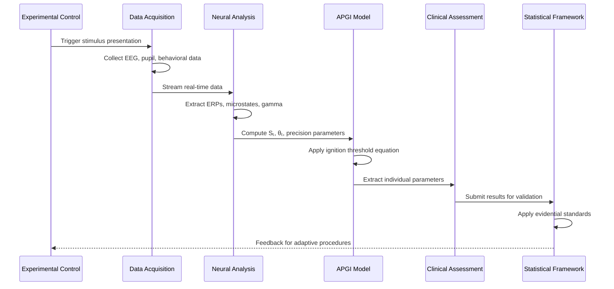

# Design Document

## Overview

The APGI Framework Implementation is a comprehensive computational neuroscience platform designed to validate the Interoceptive Predictive Ignition theory through empirical testing. The system implements a modular architecture supporting seven priority levels of validation, from direct threshold estimation to cross-species comparative analysis.

The core architecture centers around the APGI mathematical model (Sₜ = Πₑ·|εₑ| + Πᵢ(M_{c,a})·|εᵢ|) and provides integrated tools for experimental control, data collection, neural analysis, computational simulation, and clinical assessment. The platform is designed for multi-site deployment with standardized protocols ensuring reproducible research across laboratories.

## Architecture

### System Architecture Overview

```mermaid
graph TB
    subgraph "Core APGI Engine"
        IPIModel[APGI Mathematical Model]
        ThresholdEngine[Threshold Dynamics Engine]
        SomaticMarkers[Somatic Marker System]
        PrecisionWeighting[Precision Weighting Module]
    end
    
    subgraph "Experimental Control"
        StimulusPresentation[Stimulus Presentation System]
        AdaptiveStaircase[Adaptive Staircase Procedures]
        TaskManager[Multi-Modal Task Manager]
        TimingControl[Millisecond Precision Timing]
    end
    
    subgraph "Data Acquisition"
        EEGInterface[EEG/MEG Interface]
        PupillometryInterface[Pupillometry Interface]
        BehavioralInterface[Behavioral Response Interface]
        PhysiologicalInterface[Physiological Monitoring]
    end
    
    subgraph "Neural Analysis"
        ERPAnalysis[ERP Analysis Pipeline]
        MicrostateAnalysis[Microstate Analysis]
        GammaAnalysis[Gamma Synchrony Analysis]
        PCIComputation[PCI Computation]
    end
    
    subgraph "Computational Simulation"
        AgentSimulation[APGI Agent Simulation]
        EnvironmentModeling[Environment Modeling]
        ComparativeAnalysis[Agent Performance Analysis]
        ParameterOptimization[Parameter Optimization]
    end
    
    subgraph "Clinical Assessment"
        DisorderClassification[Disorder Classification]
        TreatmentPrediction[Treatment Response Prediction]
        ParameterExtraction[Clinical Parameter Extraction]
        LongitudinalTracking[Longitudinal Progress Tracking]
    end
    
    subgraph "Statistical Framework"
        EvidentialStandards[Evidential Standards Engine]
        PowerAnalysis[Statistical Power Analysis]
        ReplicationTracking[Multi-Site Replication Tracking]
        FalsificationDetection[Falsification Detection]
    end
    
    IPIModel --> ThresholdEngine
    IPIModel --> SomaticMarkers
    IPIModel --> PrecisionWeighting
    
    StimulusPresentation --> TaskManager
    AdaptiveStaircase --> TaskManager
    TaskManager --> TimingControl
    
    EEGInterface --> ERPAnalysis
    EEGInterface --> MicrostateAnalysis
    EEGInterface --> GammaAnalysis
    PupillometryInterface --> ERPAnalysis
    
    ERPAnalysis --> IPIModel
    MicrostateAnalysis --> IPIModel
    GammaAnalysis --> IPIModel
    
    IPIModel --> AgentSimulation
    AgentSimulation --> EnvironmentModeling
    
    IPIModel --> DisorderClassification
    DisorderClassification --> TreatmentPrediction
    
    ERPAnalysis --> EvidentialStandards
    AgentSimulation --> EvidentialStandards
    DisorderClassification --> EvidentialStandards
```



### Data Flow Architecture



## Components and Interfaces

### 1. Core APGI Mathematical Engine

**IPIModel Class**
- Implements core equation: Sₜ = Πₑ·|εₑ| + Πᵢ(M_{c,a})·|εᵢ|
- Computes ignition probability: Bₜ = σ(α(Sₜ - θₜ))
- Manages parameter updates and validation
- Supports real-time computation for closed-loop experiments

**ThresholdDynamics Class**
- Models dynamic threshold adjustment based on context
- Implements metabolic cost functions
- Supports pharmacological and perturbational modifications
- Provides uncertainty quantification for threshold estimates

**SomaticMarkerSystem Class**
- Manages learned value functions M_{c,a}
- Updates precision modulation based on experience
- Supports trauma-related marker modeling for PTSD studies
- Implements context-dependent gain modulation

### 2. Experimental Control System

**MultiModalTaskManager Class**
- Coordinates visual, auditory, and interoceptive stimulus presentation
- Implements adaptive staircase procedures for threshold estimation
- Manages trial sequencing and randomization
- Provides millisecond-precision timing control

**StimulusPresentation Interface**
- Visual: Gabor patches, faces, words with intensity control
- Auditory: Tones, words with volume/frequency modulation
- Interoceptive: Heartbeat detection, CO₂ challenges, thermal stimuli
- Supports multi-modal simultaneous presentation

**AdaptiveStaircase Class**
- Implements QUEST, PEST, and custom adaptive algorithms
- Estimates 50% detection thresholds across modalities
- Provides real-time threshold updates
- Supports Bayesian parameter estimation

### 3. Neural Data Processing Pipeline

**ERPAnalysis Module**
- P3b extraction with peak detection and area-under-curve measures
- Early ERP component analysis (N1, P1, N170)
- Single-trial ERP estimation using advanced filtering
- Artifact rejection and signal quality assessment

**MicrostateAnalysis Module**
- Scalp topography clustering into canonical states
- Transition probability estimation between microstates
- Temporal dynamics analysis with millisecond resolution
- Integration with ignition timing predictions

**GammaSynchronyAnalysis Module**
- Cross-frequency coupling analysis
- Long-range coherence between frontal and posterior regions
- Phase-amplitude coupling detection
- Network connectivity estimation

**PCIComputation Module**
- Perturbational Complexity Index calculation
- Integration with TMS protocols
- Real-time complexity estimation
- Consciousness level assessment

### 4. Computational Agent Framework

**IPIAgent Class**
- Implements full APGI architecture with configurable parameters
- Supports somatic marker learning and application
- Provides embodied decision-making in simulated environments
- Enables parameter sensitivity analysis

**EnvironmentSimulation Class**
- Foraging environments with volatile reward contingencies
- High-cost state modeling (poisoned food sources)
- Resource constraint implementation
- Multi-agent interaction support

**AgentComparison Framework**
- Standard predictive processing agent implementation
- Threshold-only agent (no somatic bias)
- Performance metric calculation and visualization
- Statistical comparison across conditions

### 5. Clinical Assessment Tools

**DisorderClassification Module**
- GAD, panic disorder, social anxiety differentiation
- Neural signature extraction and comparison
- Machine learning classification with >75% accuracy target
- Cross-validation and generalization testing

**TreatmentPrediction System**
- Baseline parameter extraction for treatment matching
- SSRI vs SNRI response prediction
- Longitudinal parameter tracking
- Treatment outcome correlation analysis

**ClinicalParameterExtraction Class**
- 30-minute assessment battery implementation
- Individual θₜ, Πₑ, Πᵢ, β parameter estimation
- Reliability and validity assessment
- Clinical report generation

### 6. Statistical Validation Framework

**EvidentialStandards Engine**
- Strong support: Effect > predicted magnitude, p < 0.01, replicated
- Moderate support: Effect in predicted direction, p < 0.05, single lab
- Weak support: Effect in direction but smaller, p < 0.05, needs replication
- Falsification detection: Opposite effects or missing mechanisms

**PowerAnalysis Module**
- Sample size calculation for each prediction
- Effect size estimation and confidence intervals
- Multi-site power aggregation
- Sequential analysis for early stopping

**ReplicationTracking System**
- Multi-laboratory result aggregation
- Meta-analysis pipeline
- Publication bias detection
- Reproducibility metrics

## Data Models

### Core Data Structures

**IPIParameters**
```python
@dataclass
class IPIParameters:
    theta_t: float  # Ignition threshold
    pi_e: float     # Exteroceptive precision
    pi_i: float     # Interoceptive precision
    alpha: float    # Sigmoid steepness
    beta: float     # Somatic bias weight
    gamma: float    # Homeostatic recovery rate
    timestamp: datetime
    confidence_intervals: Dict[str, Tuple[float, float]]
```

**ExperimentalTrial**
```python
@dataclass
class ExperimentalTrial:
    trial_id: str
    participant_id: str
    stimulus_type: str
    stimulus_intensity: float
    response_time: float
    conscious_report: bool
    eeg_data: np.ndarray
    pupil_data: np.ndarray
    timestamp: datetime
    context_factors: Dict[str, Any]
```

**NeuralSignatures**
```python
@dataclass
class NeuralSignatures:
    p3b_amplitude: float
    p3b_latency: float
    gamma_power: float
    microstate_transitions: List[Tuple[str, str, float]]
    pci_score: float
    early_erp_components: Dict[str, float]
```

### Database Schema

**Participants Table**
- participant_id (Primary Key)
- demographics (age, gender, handedness)
- clinical_status (control, GAD, panic, social_anxiety, depression, PTSD)
- medication_status
- consent_date

**Experiments Table**
- experiment_id (Primary Key)
- participant_id (Foreign Key)
- experiment_type (threshold_estimation, oddball, clinical_assessment)
- session_date
- equipment_configuration
- data_quality_metrics

**Trials Table**
- trial_id (Primary Key)
- experiment_id (Foreign Key)
- trial_parameters
- behavioral_responses
- neural_data_path
- analysis_results

**Parameters Table**
- parameter_id (Primary Key)
- participant_id (Foreign Key)
- extraction_method
- ipi_parameters (JSON)
- reliability_metrics
- extraction_date

## Error Handling

### Data Quality Assurance

**Real-time Monitoring**
- EEG artifact detection with automatic trial rejection
- Pupillometry blink detection and interpolation
- Behavioral response validation (reaction time limits)
- Equipment malfunction detection and alerts

**Data Validation Pipeline**
- Signal-to-noise ratio assessment
- Statistical outlier detection
- Cross-modal consistency checks
- Temporal alignment verification

**Error Recovery Strategies**
- Automatic trial repetition for poor quality data
- Adaptive threshold adjustment for equipment drift
- Backup data collection protocols
- Manual quality control checkpoints

### Statistical Robustness

**Multiple Comparisons Correction**
- Bonferroni correction for family-wise error rate
- False Discovery Rate control for exploratory analyses
- Bayesian approaches for parameter estimation
- Cross-validation for model selection

**Replication Framework**
- Pre-registered analysis plans
- Standardized effect size reporting
- Multi-site coordination protocols
- Publication bias mitigation strategies

## Testing Strategy

### Unit Testing

**Core Mathematical Functions**
- APGI equation implementation accuracy
- Threshold dynamics computation
- Somatic marker updates
- Precision weighting calculations

**Data Processing Modules**
- ERP extraction algorithms
- Microstate classification accuracy
- Gamma synchrony detection
- PCI computation validation

### Integration Testing

**End-to-End Experimental Workflows**
- Stimulus presentation to data analysis pipeline
- Real-time parameter estimation accuracy
- Multi-modal data synchronization
- Clinical assessment battery completion

**Cross-Platform Compatibility**
- EEG system integration (multiple vendors)
- Eye-tracker compatibility
- Operating system support (Windows, macOS, Linux)
- Hardware timing validation

### Validation Testing

**Synthetic Data Validation**
- Known-parameter recovery from simulated data
- Noise robustness testing
- Edge case handling (extreme parameter values)
- Computational performance benchmarking

**Clinical Validation Studies**
- Test-retest reliability assessment
- Inter-rater reliability for manual scoring
- Criterion validity against established measures
- Predictive validity for treatment outcomes

### Performance Testing

**Real-time Processing Requirements**
- Sub-millisecond timing accuracy for stimulus presentation
- Real-time EEG processing with <50ms latency
- Concurrent multi-modal data acquisition
- Memory usage optimization for long experiments

**Scalability Testing**
- Multi-participant concurrent sessions
- Large dataset processing capabilities
- Multi-site data aggregation performance
- Cloud deployment scalability

### Regression Testing

**Algorithm Stability**
- Parameter estimation consistency across software versions
- Backward compatibility for data formats
- Analysis pipeline reproducibility
- Statistical result stability

**Clinical Decision Support**
- Treatment prediction accuracy maintenance
- Disorder classification performance
- Parameter extraction reliability
- Longitudinal tracking consistency

This comprehensive design provides the technical foundation for implementing all seven priority levels of APGI framework validation while ensuring scientific rigor, clinical utility, and computational efficiency.