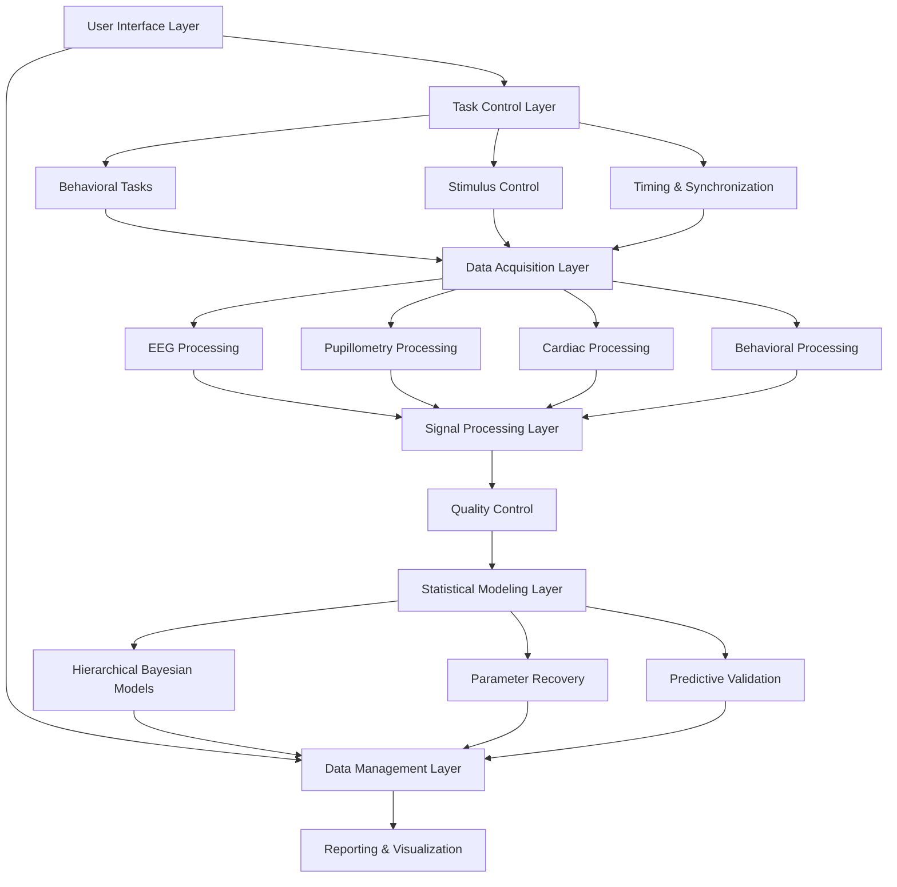

# Design Document

## Overview

The IPI Framework Parameter Estimation Pipeline is designed as a modular, real-time neuroscience research platform that integrates behavioral task presentation, multi-modal physiological data acquisition (EEG, pupillometry, cardiac), and advanced statistical modeling. The system architecture follows a layered approach with clear separation between data acquisition, signal processing, task control, and statistical analysis components.

The core design philosophy emphasizes:
- Real-time processing capabilities for immediate feedback
- Modular architecture for easy extension and maintenance  
- Robust error handling and data quality assurance
- Clinical feasibility with streamlined workflows
- Reproducible research through standardized protocols

## Architecture

### System Architecture Overview



### Core Components

#### 1. Task Control Layer
- **Adaptive Staircase Engine**: Implements QUEST+ algorithm for optimal stimulus selection
- **Timing Controller**: Ensures precise stimulus timing and synchronization across modalities
- **Response Handler**: Manages participant input and confidence ratings
- **Session Manager**: Controls task flow and participant state

#### 2. Data Acquisition Layer
- **EEG Interface**: Connects to high-density EEG systems (128+ channels) via LSL or manufacturer APIs
- **Pupillometry Interface**: Handles high-speed eye tracking (1000 Hz) with real-time artifact detection
- **Cardiac Interface**: Processes ECG/PPG signals for R-peak detection and HEP analysis
- **Behavioral Interface**: Records responses, reaction times, and confidence ratings

#### 3. Signal Processing Layer
- **EEG Processor**: Real-time filtering, artifact rejection (FASTER algorithm), and ERP extraction
- **Pupil Processor**: Blink detection, interpolation, and baseline correction
- **Cardiac Processor**: R-peak detection, HRV analysis, and cardiac timing
- **Feature Extractor**: Computes P3b, HEP, and other neural markers

#### 4. Statistical Modeling Layer
- **Bayesian Engine**: Stan/PyMC3 integration for hierarchical model fitting
- **Parameter Estimator**: Computes θ₀, Πᵢ, and β with uncertainty quantification
- **Model Validator**: Implements parameter recovery and predictive validity testing
- **Adaptive Algorithms**: Dynamic task adjustment based on ongoing parameter estimates

## Components and Interfaces

### Behavioral Task Components

#### Detection Task (θ₀ Estimation)
```python
class DetectionTask:
    def __init__(self, modality='visual', n_trials=200, duration_minutes=10):
        self.staircase = QuestPlusStaircase()
        self.stimulus_generator = StimulusGenerator(modality)
        self.response_collector = ResponseCollector()
    
    def run_trial(self) -> TrialResult:
        intensity = self.staircase.get_next_intensity()
        stimulus = self.stimulus_generator.create(intensity)
        response = self.response_collector.wait_for_response()
        self.staircase.update(intensity, response.detected)
        return TrialResult(intensity, response, stimulus.timestamp)
```

#### Heartbeat Detection Task (Πᵢ Estimation)
```python
class HeartbeatDetectionTask:
    def __init__(self, n_trials=60, duration_minutes=8):
        self.cardiac_monitor = CardiacMonitor()
        self.tone_generator = ToneGenerator()
        self.confidence_collector = ConfidenceCollector()
    
    def run_trial(self) -> HeartbeatTrialResult:
        r_peak_time = self.cardiac_monitor.wait_for_r_peak()
        is_synchronous = random.choice([True, False])
        tone_delay = 0 if is_synchronous else random.uniform(200, 600)
        
        self.tone_generator.play_at(r_peak_time + tone_delay)
        response = self.confidence_collector.get_response()
        return HeartbeatTrialResult(is_synchronous, response, r_peak_time)
```

#### Dual-Modality Oddball Task (β Estimation)
```python
class DualModalityOddballTask:
    def __init__(self, n_trials=120, duration_minutes=12):
        self.intero_stimulator = InteroceptiveStimulator()  # CO2 puffs
        self.extero_stimulator = ExteroceptiveStimulator()  # Visual Gabors
        self.calibrator = StimulusCalibrator()
    
    def calibrate_stimuli(self):
        """Ensure Πₑ ≈ Πᵢ through separate staircase procedures"""
        self.intero_threshold = self.calibrator.find_threshold('interoceptive')
        self.extero_threshold = self.calibrator.find_threshold('exteroceptive')
    
    def run_trial(self) -> OddballTrialResult:
        trial_type = self.get_trial_type()  # standard, intero_deviant, extero_deviant
        stimulus = self.create_stimulus(trial_type)
        response = self.collect_response()
        return OddballTrialResult(trial_type, stimulus, response)
```

### Signal Processing Components

#### EEG Processing Pipeline
```python
class EEGProcessor:
    def __init__(self, sampling_rate=1000, n_channels=128):
        self.filter_bank = FilterBank([0.1, 30])  # Bandpass filter
        self.artifact_detector = FASTERArtifactDetector()
        self.erp_extractor = ERPExtractor()
    
    def process_realtime(self, raw_data: np.ndarray) -> ProcessedEEG:
        filtered = self.filter_bank.apply(raw_data)
        clean_data = self.artifact_detector.clean(filtered)
        features = self.erp_extractor.extract_features(clean_data)
        return ProcessedEEG(clean_data, features)
    
    def extract_p3b(self, epochs: np.ndarray, electrode='Pz') -> np.ndarray:
        """Extract P3b amplitude (250-500ms) at specified electrode"""
        time_window = self.get_time_indices(250, 500)
        p3b_amplitudes = np.mean(epochs[:, electrode, time_window], axis=1)
        return p3b_amplitudes
    
    def extract_hep(self, epochs: np.ndarray, r_peaks: np.ndarray) -> np.ndarray:
        """Extract heartbeat-evoked potential (250-400ms post R-peak)"""
        hep_epochs = self.epoch_around_events(epochs, r_peaks, -200, 800)
        time_window = self.get_time_indices(250, 400)
        hep_amplitudes = np.mean(hep_epochs[:, :, time_window], axis=2)
        return hep_amplitudes
```

#### Pupillometry Processing
```python
class PupillometryProcessor:
    def __init__(self, sampling_rate=1000):
        self.blink_detector = BlinkDetector()
        self.interpolator = CubicSplineInterpolator()
        self.baseline_corrector = BaselineCorrector()
    
    def process_trial(self, pupil_data: np.ndarray, trial_events: List[Event]) -> PupilResponse:
        # Detect and interpolate blinks
        blinks = self.blink_detector.detect(pupil_data)
        clean_data = self.interpolator.interpolate_blinks(pupil_data, blinks)
        
        # Baseline correction and feature extraction
        baseline_corrected = self.baseline_corrector.correct(clean_data, trial_events)
        features = self.extract_features(baseline_corrected, trial_events)
        
        return PupilResponse(clean_data, features, blinks)
    
    def extract_features(self, data: np.ndarray, events: List[Event]) -> Dict:
        """Extract pupil dilation features (200-500ms post-stimulus)"""
        features = {}
        for event in events:
            window_data = self.get_time_window(data, event.timestamp, 200, 500)
            features[event.type] = {
                'peak_dilation': np.max(window_data),
                'mean_dilation': np.mean(window_data),
                'time_to_peak': np.argmax(window_data) * (1000/self.sampling_rate)
            }
        return features
```

### Statistical Modeling Components

#### Hierarchical Bayesian Model
```python
class HierarchicalBayesianModel:
    def __init__(self):
        self.stan_model = self.compile_stan_model()
        self.parameter_priors = self.define_priors()
    
    def define_stan_model(self) -> str:
        return """
        data {
            int<lower=0> N_subjects;
            int<lower=0> N_trials;
            vector[N_trials] stimulus_intensity;
            int<lower=0,upper=1> detected[N_trials];
            vector[N_trials] p3b_amplitude;
            vector[N_trials] hep_amplitude;
            vector[N_trials] pupil_response;
        }
        
        parameters {
            // Population-level parameters
            real mu_theta0;
            real<lower=0> sigma_theta0;
            real mu_pi_i;
            real<lower=0> sigma_pi_i;
            real mu_beta;
            real<lower=0> sigma_beta;
            
            // Individual-level parameters
            vector[N_subjects] theta0_raw;
            vector[N_subjects] pi_i_raw;
            vector[N_subjects] beta_raw;
        }
        
        transformed parameters {
            vector[N_subjects] theta0 = mu_theta0 + sigma_theta0 * theta0_raw;
            vector[N_subjects] pi_i = mu_pi_i + sigma_pi_i * pi_i_raw;
            vector[N_subjects] beta = mu_beta + sigma_beta * beta_raw;
        }
        
        model {
            // Priors
            mu_theta0 ~ normal(0, 1);
            sigma_theta0 ~ exponential(1);
            theta0_raw ~ std_normal();
            
            // Likelihood for detection task
            for (n in 1:N_trials) {
                detected[n] ~ bernoulli_logit(theta0[subject[n]] * stimulus_intensity[n]);
            }
            
            // Neural data likelihood
            p3b_amplitude ~ normal(theta0[subject], 0.1);
            hep_amplitude ~ normal(pi_i[subject], 0.1);
        }
        """
    
    def fit_model(self, data: Dict) -> BayesianResults:
        """Fit hierarchical Bayesian model to all data"""
        fit = self.stan_model.sample(data=data, chains=4, iter=2000)
        return BayesianResults(fit)
    
    def extract_parameters(self, fit: BayesianResults) -> ParameterEstimates:
        """Extract θ₀, Πᵢ, and β with credible intervals"""
        theta0 = fit.extract('theta0')
        pi_i = fit.extract('pi_i') 
        beta = fit.extract('beta')
        
        return ParameterEstimates(
            theta0=self.compute_credible_interval(theta0),
            pi_i=self.compute_credible_interval(pi_i),
            beta=self.compute_credible_interval(beta)
        )
```

## Data Models

### Core Data Structures

#### Trial Data Model
```python
@dataclass
class TrialData:
    trial_id: str
    participant_id: str
    task_type: TaskType
    timestamp: datetime
    stimulus_parameters: Dict[str, Any]
    behavioral_response: BehavioralResponse
    eeg_data: Optional[np.ndarray]
    pupil_data: Optional[np.ndarray]
    cardiac_data: Optional[np.ndarray]
    quality_metrics: QualityMetrics

@dataclass
class BehavioralResponse:
    response_time: float
    detected: bool
    confidence: Optional[float]
    response_key: str
    
@dataclass
class QualityMetrics:
    eeg_artifact_ratio: float
    pupil_data_loss: float
    cardiac_signal_quality: float
    overall_quality_score: float
```

#### Parameter Estimates Model
```python
@dataclass
class ParameterEstimates:
    participant_id: str
    session_id: str
    theta0: ParameterDistribution  # Baseline ignition threshold
    pi_i: ParameterDistribution    # Interoceptive precision
    beta: ParameterDistribution    # Somatic bias
    model_fit_metrics: ModelFitMetrics
    reliability_metrics: ReliabilityMetrics

@dataclass
class ParameterDistribution:
    mean: float
    std: float
    credible_interval_95: Tuple[float, float]
    posterior_samples: np.ndarray
```

### Database Schema

#### Sessions Table
```sql
CREATE TABLE sessions (
    session_id UUID PRIMARY KEY,
    participant_id VARCHAR(50) NOT NULL,
    session_date TIMESTAMP NOT NULL,
    protocol_version VARCHAR(20) NOT NULL,
    completion_status VARCHAR(20) NOT NULL,
    total_duration_minutes INTEGER,
    data_quality_score FLOAT,
    notes TEXT
);
```

#### Trials Table
```sql
CREATE TABLE trials (
    trial_id UUID PRIMARY KEY,
    session_id UUID REFERENCES sessions(session_id),
    task_type VARCHAR(50) NOT NULL,
    trial_number INTEGER NOT NULL,
    stimulus_intensity FLOAT,
    response_detected BOOLEAN,
    response_time_ms FLOAT,
    confidence_rating FLOAT,
    eeg_quality_score FLOAT,
    pupil_quality_score FLOAT,
    cardiac_quality_score FLOAT,
    timestamp TIMESTAMP NOT NULL
);
```

#### Parameter Estimates Table
```sql
CREATE TABLE parameter_estimates (
    estimate_id UUID PRIMARY KEY,
    session_id UUID REFERENCES sessions(session_id),
    theta0_mean FLOAT NOT NULL,
    theta0_std FLOAT NOT NULL,
    theta0_ci_lower FLOAT NOT NULL,
    theta0_ci_upper FLOAT NOT NULL,
    pi_i_mean FLOAT NOT NULL,
    pi_i_std FLOAT NOT NULL,
    pi_i_ci_lower FLOAT NOT NULL,
    pi_i_ci_upper FLOAT NOT NULL,
    beta_mean FLOAT NOT NULL,
    beta_std FLOAT NOT NULL,
    beta_ci_lower FLOAT NOT NULL,
    beta_ci_upper FLOAT NOT NULL,
    model_convergence_rhat FLOAT,
    effective_sample_size INTEGER,
    created_at TIMESTAMP DEFAULT CURRENT_TIMESTAMP
);
```

## Error Handling

### Data Quality Assurance
- **Real-time monitoring**: Continuous assessment of signal quality with immediate alerts
- **Adaptive protocols**: Automatic adjustment of task parameters when data quality degrades
- **Graceful degradation**: System continues operation with reduced functionality when components fail
- **Data validation**: Comprehensive checks for physiological plausibility and statistical outliers

### Error Recovery Strategies
- **EEG artifacts**: FASTER algorithm with manual review option for borderline cases
- **Pupil tracking loss**: Automatic recalibration and interpolation for brief losses
- **Cardiac signal issues**: Backup PPG sensor and manual R-peak marking interface
- **Task interruptions**: Session pause/resume with state preservation

### Validation Protocols
- **Parameter recovery validation**: Mandatory before empirical data collection
- **Cross-validation**: K-fold validation for model generalization assessment
- **Test-retest reliability**: Automated ICC calculation with confidence intervals
- **Predictive validity**: Systematic testing against independent behavioral measures

## Testing Strategy

### Unit Testing
- **Signal processing algorithms**: Synthetic data with known ground truth
- **Statistical models**: Parameter recovery with simulated datasets
- **Task components**: Automated behavioral response simulation
- **Data quality metrics**: Edge case testing with corrupted signals

### Integration Testing
- **Multi-modal synchronization**: Timing accuracy across EEG, pupillometry, and behavior
- **Real-time processing**: Latency and throughput testing under load
- **Database operations**: Concurrent access and data integrity testing
- **User interface**: End-to-end workflow testing with simulated participants

### Validation Testing
- **Parameter recovery study**: 100 synthetic datasets with known parameters
- **Reliability assessment**: Test-retest correlation analysis
- **Predictive validity**: Independent task correlation studies
- **Clinical feasibility**: Usability testing with research staff

### Performance Testing
- **Real-time constraints**: Sub-millisecond timing accuracy verification
- **Memory usage**: Long session stability testing
- **Concurrent processing**: Multi-participant session capability
- **Data throughput**: High-density EEG processing performance

The testing strategy emphasizes automated validation to ensure reproducible research outcomes and clinical reliability of the parameter estimation pipeline.