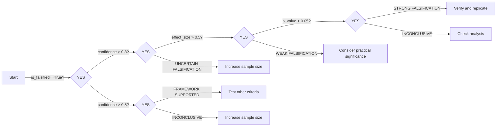
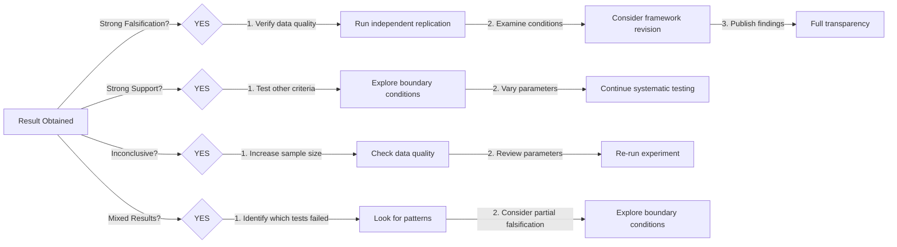

# APGI Framework Falsification Results - Interpretation Guide

## Table of Contents

1. [Introduction](#introduction)
2. [Understanding Falsification Logic](#understanding-falsification-logic)
3. [Statistical Metrics Explained](#statistical-metrics-explained)
4. [Test-Specific Interpretations](#test-specific-interpretations)
5. [Common Scenarios](#common-scenarios)
6. [Decision Trees](#decision-trees)
7. [Reporting Guidelines](#reporting-guidelines)

## Introduction

This guide helps you interpret the results of APGI Framework falsification tests. Proper interpretation is crucial for:

- Understanding what the results mean for the framework
- Making informed decisions about next steps
- Reporting findings accurately
- Avoiding common misinterpretations

### Key Principle

Falsification testing follows Karl Popper's philosophy: we attempt to **disprove** the theory. A theory that survives rigorous falsification attempts gains credibility, while one that fails is either rejected or requires modification.

## Understanding Falsification Logic

### The Four Falsification Criteria

#### 1. Primary Falsification (Most Decisive)

##### Criterion: Full ignition signatures WITHOUT consciousness

##### Logic:

- APGI Framework predicts: Ignition → Consciousness
- Falsification occurs if: Ignition ∧ ¬Consciousness
- If falsified: Framework is decisively refuted

#### What to Look for

- All neural signatures present (P3b > 5μV, gamma PLV > 0.3, BOLD Z > 3.1, PCI > 0.4)
- No subjective report of consciousness
- Forced-choice performance at chance level
- AI/ACC not engaged (BOLD < 3.1, gamma PLV ≤ 0.25)

#### 2. Consciousness Without Ignition

##### Criterion: Consciousness WITHOUT ignition signatures

##### Logic:

- APGI Framework predicts: Consciousness → Ignition
- Falsification occurs if: Consciousness ∧ ¬Ignition
- If falsified: Alternative routes to consciousness exist

#### What to Look for

- Conscious reports (subjective + above-chance forced-choice)
- Subthreshold neural signatures (P3b < 2μV, gamma PLV < 0.15, PCI < 0.3)
- No frontoparietal BOLD elevation
- Occurs in >20% of trials

#### 3. Threshold Insensitivity

##### Criterion: Threshold unaffected by neuromodulation

##### Logic:

- APGI Framework predicts: Neuromodulators → Threshold changes
- Falsification occurs if: Neuromodulation ∧ ¬Threshold change
- If falsified: Threshold is fixed, not dynamic

#### What to Look For

- Pharmacological manipulation (propranolol, L-DOPA, SSRIs, physostigmine)
- No significant threshold modulation
- Ignition patterns unchanged despite neuromodulatory changes

#### 4. Soma-Bias Absence

##### Criterion: No preferential interoceptive weighting

##### Logic:

- APGI Framework predicts: Interoceptive signals have special status (β > 1)
- Falsification occurs if: β ≈ 1 (no bias)
- If falsified: Interoception has no special role

#### What to Look For

- β (interoceptive/exteroceptive weighting ratio) between 0.95-1.05
- Equal weighting of interoceptive and exteroceptive signals
- No preferential processing of bodily signals

### Falsification vs. Confirmation

#### Important: These tests are designed to **falsify**, not confirm.

| Result | Interpretation | Strength |
| -------- | --------------- | ---------- |
| NOT Falsified | Framework survives this test | Moderate support |
| Falsified | Framework contradicted | Strong evidence against |

#### Key Point: "Not falsified" ≠ "proven true". It means that the framework survived this particular challenge.

## Statistical Metrics Explained

### Confidence Level

#### Definition: Degree of certainty in the falsification result.

#### Range: 0.0 (no confidence) to 1.0 (complete confidence)

#### Interpretation:

| Range | Interpretation | Action |
| ------- | --------------- | -------- |
| 0.0 - 0.5 | Low confidence | Increase sample size, check data quality |
| 0.5 - 0.7 | Moderate confidence | Acceptable for exploratory research |
| 0.7 - 0.9 | High confidence | Acceptable for most purposes |
| 0.9 - 1.0 | Very high confidence | Publication-quality evidence |

**Example**:

```python
Confidence Level: 0.85
Interpretation: High confidence in the result.
85% certain of the falsification status.
```

### P-value

**Definition**: Probability of observing results this extreme if the null hypothesis is true.

**Range**: 0.0 to 1.0

**Interpretation**:

| P-value | Interpretation | Significance |
| --------- | --------------- | -------------- |
| < 0.001 | Extremely significant | *** |
| < 0.01 | Highly significant | ** |
| < 0.05 | Significant | * |
| ≥ 0.05 | Not significant | ns |

**Common Misinterpretations**:

- ❌ "p = 0.05 means 95% probability the hypothesis is true"
- ❌ "p < 0.05 means the effect is large or important"
- ✅ "p < 0.05 means results are unlikely under null hypothesis"

**Example**:

```python
P-value: 0.003
Interpretation: Results are highly significant (p < 0.01).
Only 0.3% chance of observing this if null hypothesis true.
```

### Effect Size (Cohen's d)

**Definition**: Standardized measure of the magnitude of the effect.

**Range**: -∞ to +∞ (typically -3 to +3)

**Interpretation**:

|  | d |  | Interpretation | Practical Significance |
| ------ | --------------- | ---------------------- |
| < 0.2 | Negligible | Very small, may not matter |
| 0.2 - 0.5 | Small | Noticeable to experts |
| 0.5 - 0.8 | Medium | Noticeable to informed observers |
| ≥ 0.8 | Large | Obvious to anyone |

**Why it matters**: P-values depend on sample size, but effect sizes don't. A large sample can make a tiny effect "significant" (low p-value) but practically meaningless (small d).

**Example**:

```python
Effect Size (Cohen's d): 0.65
Interpretation: Medium to large effect.
Difference is noticeable and practically meaningful.
```

### Statistical Power

**Definition**: Probability of detecting an effect if it truly exists.

**Range**: 0.0 to 1.0

**Interpretation**:

| Power | Interpretation | Action |
| ------- | --------------- | -------- |
| < 0.5 | Underpowered | Increase sample size significantly |
| 0.5 - 0.8 | Adequate | Acceptable for exploratory work |
| ≥ 0.8 | Well-powered | Standard target for research |
| ≥ 0.95 | Very well-powered | Excellent for detecting effects |

**Why it matters**: Low power means you might miss real effects (false negatives). High power ensures you can detect effects if they exist.

**Example**:

```python
Statistical Power: 0.82
Interpretation: Well-powered study.
82% chance of detecting effect if it exists.
```

### Putting It All Together

**Ideal Result**:

- High confidence (> 0.8)
- Significant p-value (< 0.05)
- Meaningful effect size (|d| > 0.5)
- Adequate power (> 0.8)

**Red Flags**:

- Low confidence + significant p-value → Check data quality
- High p-value + large effect size → Increase sample size
- Significant p-value + tiny effect size → May not be practically meaningful
- Low power → Results unreliable, increase sample size

## Test-Specific Interpretations

### Primary Falsification Test

#### Result Structure

```python
FalsificationResult(
  test_type='primary_falsification',
  is_falsified=False,
  confidence_level=0.87,
  effect_size=0.62,
  p_value=0.002,
  statistical_power=0.85,
  detailed_results={
      'full_ignition_trials': 847,
      'conscious_trials': 845,
      'unconscious_with_ignition': 2,
      'violation_rate': 0.002
  }
)
```

#### Interpretation Guide

#### Scenario 1: NOT Falsified (is_falsified=False)

```python

Falsification Status: NOT FALSIFIED
Confidence Level: 0.87
P-value: 0.002
Effect Size: 0.62

```

**Interpretation**:

- Framework survived this test
- Full ignition signatures reliably predicted consciousness
- Very few (if any) cases of ignition without consciousness
- Framework's core prediction holds under these conditions

**Implications**:

- Ignition appears necessary and sufficient for consciousness
- Framework remains viable
- Continue testing with other criteria or parameters

**Next Steps**:

- Test other falsification criteria
- Explore boundary conditions
- Vary parameters to find limits

#### Scenario 2: FALSIFIED (is_falsified=True)

```python

Falsification Status: FALSIFIED
Confidence Level: 0.91
P-value: < 0.001
Effect Size: 1.24

```python

**Interpretation**:

- ⚠️ Framework contradicted by evidence
- Multiple cases of full ignition without consciousness observed
- Core prediction of framework violated
- This is decisive falsification

**Implications**:

- Ignition is NOT sufficient for consciousness
- Framework requires major revision or rejection
- Alternative mechanisms must be considered

**Next Steps**:

- Verify results with independent replication
- Examine conditions under which falsification occurred
- Consider framework modifications
- Explore alternative theories

#### Edge Cases

**High p-value, low confidence**:
```python
is_falsified=False, confidence=0.52, p_value=0.18
```
**Interpretation**: Inconclusive. Increase sample size.

**Significant but small effect**:
```python
is_falsified=True, effect_size=0.15, p_value=0.03
```
**Interpretation**: Statistically significant but practically negligible. May not be meaningful falsification.

### Consciousness Without Ignition Test

#### Interpretation Guide

**NOT Falsified**:
```python
Violation Rate: 8% (< 20% threshold)
Interpretation: Consciousness rarely occurs without ignition.
Framework prediction supported.
```

**FALSIFIED**:
```python
Violation Rate: 27% (> 20% threshold)
Interpretation: Consciousness frequently occurs without ignition.
Alternative routes to consciousness exist.
Framework falsified.
```

**Implications**:

- NOT Falsified: Ignition appears necessary for consciousness
- FALSIFIED: Consciousness can occur via non-ignition mechanisms

### Threshold Insensitivity Test

#### Interpretation Guide

**NOT Falsified**:
```python
Threshold Modulation: Significant (p < 0.05)
Propranolol: -0.4 units
L-DOPA: +0.3 units
Interpretation: Threshold is neuromodulatory-sensitive as predicted.
```

**FALSIFIED**:
```python
Threshold Modulation: Not significant (p = 0.42)
All drugs: No significant effect
Interpretation: Threshold is fixed, not dynamic.
Framework prediction violated.
```

**Implications**:

- NOT Falsified: Dynamic threshold mechanism supported
- FALSIFIED: Threshold is fixed, contradicting framework

### Soma-Bias Test

#### Interpretation Guide

**NOT Falsified**:
```python
β (intero/extero ratio): 1.45 (95% CI: [1.32, 1.58])
Interpretation: Significant interoceptive bias (β > 1).
Framework prediction supported.
```

**FALSIFIED**:
```python
β (intero/extero ratio): 0.98 (95% CI: [0.94, 1.02])
Interpretation: No interoceptive bias (β ≈ 1).
Framework prediction violated.
```

**Implications**:

- NOT Falsified: Interoceptive signals have special status
- FALSIFIED: No preferential interoceptive processing

## Common Scenarios

### Scenario 1: Strong Evidence Against Framework

```

Test: Primary Falsification
is_falsified: True
confidence: 0.94
p_value: < 0.001
effect_size: 1.35
power: 0.92

```python

**Interpretation**: Very strong evidence that framework is falsified.

**Action**:

1. Verify data quality and analysis
2. Run independent replication
3. If confirmed, framework requires major revision
4. Publish findings with full transparency

### Scenario 2: Strong Support for Framework

```

Test: Primary Falsification
is_falsified: False
confidence: 0.89
p_value: 0.001
effect_size: 0.78
power: 0.87

```python

**Interpretation**: Strong evidence that framework survived this test.

**Action**:

1. Framework gains credibility
2. Test other falsification criteria
3. Explore boundary conditions
4. Continue systematic testing

### Scenario 3: Inconclusive Results

```

Test: Primary Falsification
is_falsified: False
confidence: 0.54
p_value: 0.12
effect_size: 0.23
power: 0.62

```python

**Interpretation**: Results are inconclusive due to low power and small effect.

**Action**:

1. Increase sample size (double or triple trials)
2. Check for data quality issues
3. Consider parameter adjustments
4. Re-run with improved design

### Scenario 4: Significant but Tiny Effect

```

Test: Primary Falsification
is_falsified: True
confidence: 0.71
p_value: 0.03
effect_size: 0.12
power: 0.85

```python

**Interpretation**: Statistically significant but effect is negligible.

**Action**:

1. Consider practical significance
2. Tiny effect may not constitute meaningful falsification
3. Examine if effect is artifact of large sample size
4. Focus on effect size, not just p-value

### Scenario 5: Mixed Results Across Tests

```python
Primary Falsification: NOT FALSIFIED (strong evidence)
Consciousness Without Ignition: FALSIFIED (moderate evidence)
Threshold Insensitivity: NOT FALSIFIED (strong evidence)
Soma-Bias: NOT FALSIFIED (strong evidence)
```

**Interpretation**: Framework partially falsified.

**Action**:

1. Framework survives most tests but fails one
2. Identify which prediction failed
3. Consider framework modification to address failure
4. May indicate boundary conditions rather than complete falsification

## Decision Trees

### Decision Tree 1: Is the Framework Falsified?



### Decision Tree 2: What Should I Do Next?



## Reporting Guidelines

### Minimum Reporting Standards

When reporting falsification test results, always include:

1. **Test Type**: Which falsification criterion was tested
2. **Sample Size**: Number of trials and participants
3. **Parameters**: All APGI parameter values used
4. **Falsification Status**: Whether framework was falsified
5. **Statistical Metrics**: Confidence, p-value, effect size, power
6. **Interpretation**: What the results mean for the framework

### Example Report

```markdown
# Primary Falsification Test Results

## Test Configuration

* Trials: 2000
* Random Seed: 42
* Exteroceptive Precision: 2.0
* Interoceptive Precision: 1.5
* Threshold: 3.5
* Steepness: 2.0
* Somatic Gain: 1.3

## Results

* Falsification Status: NOT FALSIFIED
* Confidence Level: 0.87 (high confidence)
* P-value: 0.002 (highly significant)
* Effect Size (Cohen's d): 0.62 (medium-large)
* Statistical Power: 0.85 (well-powered)

## Detailed Metrics

* Full ignition trials: 1847/2000 (92.4%)
* Conscious trials: 1845/1847 (99.9%)
* Unconscious with ignition: 2/1847 (0.1%)

## Interpretation

The APGI Framework was NOT falsified in this test. Full ignition signatures reliably predicted consciousness, with only 0.1% of trials showing ignition without consciousness. This rate is well below the falsification threshold and likely represents measurement noise. The framework's core prediction that ignition is sufficient for consciousness is strongly supported by these results.

## Implications

These results provide strong evidence for the framework's central claim. The high confidence, significant p-value, medium-large effect size, and adequate statistical power all support the conclusion. Further testing with other falsification criteria is warranted.
```

### Common Reporting Mistakes

❌ **Mistake 1**: Reporting only p-values

```python
"The test was significant (p < 0.05)"
```

✅ **Better**: Include effect size and confidence

```python
"The test showed a medium effect (d = 0.62) with high confidence (0.87) and was highly significant (p = 0.002)"
```

❌ **Mistake 2**: Confusing "not falsified" with "proven true"

```json
"The framework was proven correct"
```

✅ **Better**: Use appropriate language

```python
"The framework survived this falsification attempt, providing support for its predictions"
```

❌ **Mistake 3**: Ignoring practical significance

```python
"The effect was significant (p = 0.03)"
```

✅ **Better**: Consider effect size

```python
"While statistically significant (p = 0.03), the effect was small (d = 0.15) and may not be practically meaningful"
```

❌ **Mistake 4**: Not reporting power

```python
"No significant effect was found (p = 0.12)"
```

✅ **Better**: Include power analysis

```python
"No significant effect was found (p = 0.12), but the test was underpowered (power = 0.62), so this result is inconclusive"
```

---

**Version**: 1.0
**Last Updated**: 2025-01-07
**See Also**: [USER_GUIDE.md](USER_GUIDE.md), [CLI_REFERENCE.md](CLI_REFERENCE.md)
